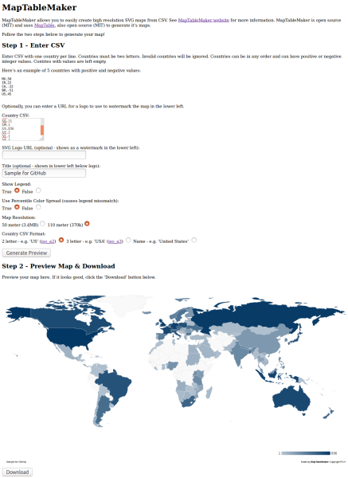

# MapTableMaker

## About

MapTableMaker is a PHP web application which allows you to  host your 
own MapTableMaker server. This server can
 easily make and let's you download high resolution SVG maps from your CSV dataset.
MapTableMaker is open source (MIT) and
uses <a href="https://github.com/Packet-Clearing-House/maptable">MapTable</a>, also open source (MIT)
to generate it's maps.

* Here is a screen shot of the web application.  Click it to go to a 
live demo:
  
  

## Requirements

* A web server running PHP
* A modern browser capable of running [d3.js](https://d3js.org/)
* A CSV data set with two letter country codes and integers
* A need for high resolution, print ready maps ;)

## Install

1. Download MapTableMaker to a web accessible directory
1. Uncompress the downloaded file
1. Browser to URL
1. Enter CSV values and submit form
1. Download map
1. Enjoy!

## License

MIT

## Releases

* 1.0 - 11/16/2016 Initial Release